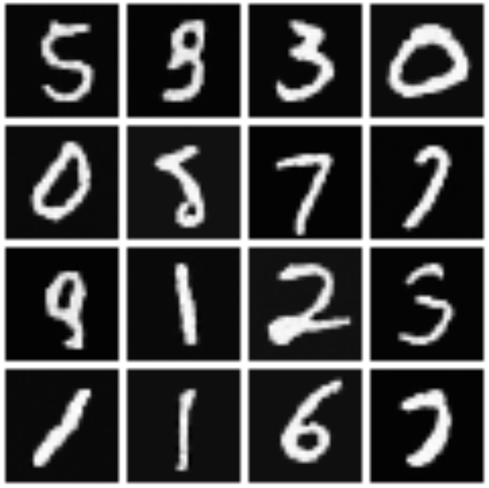

## DDPM 实现 Miniset重建

运行方式：
```bash
python main.py
```
效果：



## 优秀的博客：
[生成扩散模型漫谈（一）：DDPM = 拆楼 + 建楼](https://spaces.ac.cn/archives/9119)
[生成扩散模型漫谈（二）：DDPM = 自回归式VAE](https://spaces.ac.cn/archives/9152)
[生成扩散模型漫谈（三）：DDPM = 贝叶斯 + 去噪](https://spaces.ac.cn/archives/9164/comment-page-3#comments)


## 待整理：
DDPM公式手推

## 难点问题整理：
* 为什么前向传播之需要加噪一次，而推理时反向去噪要去噪T次？ 看上面的漫谈3

