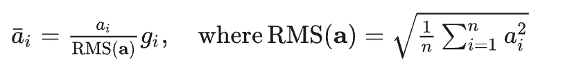
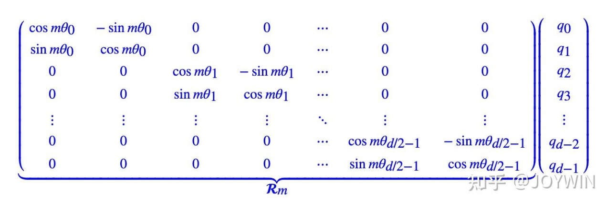
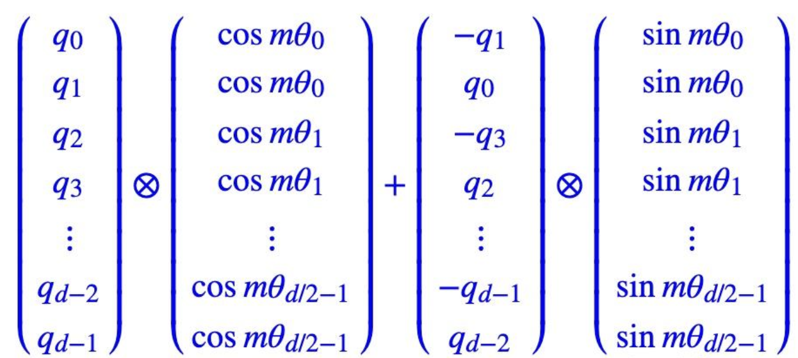
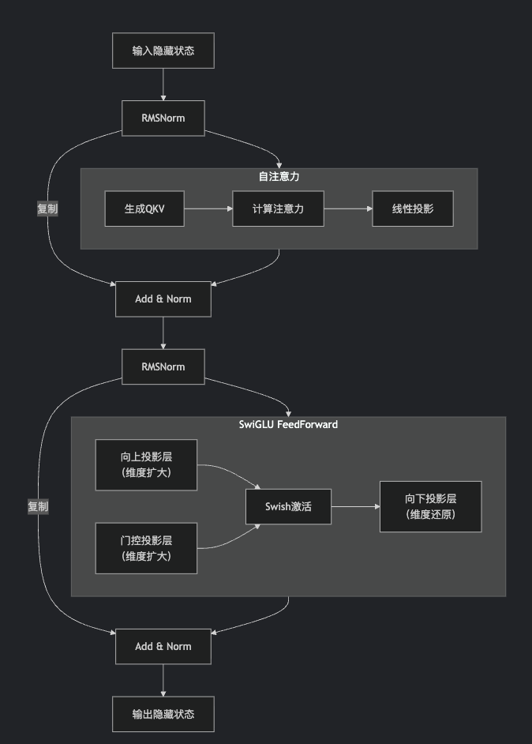

# LLaMA
author: MetaAI

# Main contribution

* RMSNorm：llama使用prenorm的方式进行归一化，先进行归一化再进行计算。对每个transformer层的输入进行归一化，而不是输出进行归一化；同时，使用 RMS Norm 归一化函数。RMS Norm 的全称为 Root Mean Square layer normalization。与 layer Norm 相比，RMS Norm的主要区别在于去掉了减去均值的部分，计算公式为：

代码实现
```python
class LlamaRMSNorm(nn.Module):
    def __init__(self, hidden_size, eps=1e-6):
        """
        LlamaRMSNorm is equivalent to T5LayerNorm
        """
        super().__init__()
        self.weight = nn.Parameter(torch.ones(hidden_size))
        self.variance_epsilon = eps

    def forward(self, hidden_states):
        input_dtype = hidden_states.dtype
        variance = hidden_states.to(torch.float32).pow(2).mean(-1, keepdim=True)
        hidden_states = hidden_states * torch.rsqrt(variance + self.variance_epsilon)

        return (self.weight * hidden_states).to(input_dtype)
```
* RoPE：旋转位置编码，之前用的位置编码，token之间会随着sqlen长度的变长而导致注意力降低，这里使用旋转位置编码可以解决这个问题，环节长距离建模的问题 RoPE 的核心思想是“通过绝对位置编码的方式实现相对位置编码”，可以说是具备了绝对位置编码的方便性，同时可以表示不同 token 之间的相对位置关系。[5] 不同于原始 Transformers 论文中，将 pos embedding 和 token embedding 进行相加，RoPE 是将位置编码和 query （或者 key） 进行相乘。具体如下：

其中，左侧的矩阵 RmR_mR_m 表示位置第 mmm 个位置的位置编码，右侧的向量 qiq_i q_i  表示对应位置的 query 向量。两者相乘，即可得到增加了位置信息的 query （或者 key）。由于 RmR_m R_m  的稀疏性，上述矩阵乘法可以等价于：


```python
# 代码增加了注释，可以看到和原始公式的对应关系。
class LlamaRotaryEmbedding(torch.nn.Module):
    def __init__(self, dim, max_position_embeddings=2048, base=10000, device=None):
        super().__init__()
        # 此处 inv_freq 对应公式中的 theta
        inv_freq = 1.0 / (base ** (torch.arange(0, dim, 2).float().to(device) / dim))
        self.register_buffer("inv_freq", inv_freq)

        self.max_seq_len_cached = max_position_embeddings
        t = torch.arange(self.max_seq_len_cached, device=self.inv_freq.device, dtype=self.inv_freq.dtype)
        # 此处 freqs 对应公式中的 m * theta, t 对应公式中的 m，表示位置
        freqs = torch.einsum("i,j->ij", t, self.inv_freq)
        # Different from paper, but it uses a different permutation in order to obtain the same calculation
        # 此处和原始公式不同，theta_0 和 theta_0 不再相邻
        # 而是分在向量的前半部分和后半部分
        emb = torch.cat((freqs, freqs), dim=-1)
        dtype = torch.get_default_dtype()
        self.register_buffer("cos_cached", emb.cos()[None, None, :, :].to(dtype), persistent=False)
        self.register_buffer("sin_cached", emb.sin()[None, None, :, :].to(dtype), persistent=False)

    def forward(self, x, seq_len=None):
        # x: [bs, num_attention_heads, seq_len, head_size]
        if seq_len > self.max_seq_len_cached:
            self.max_seq_len_cached = seq_len
            t = torch.arange(self.max_seq_len_cached, device=x.device, dtype=self.inv_freq.dtype)
            freqs = torch.einsum("i,j->ij", t, self.inv_freq)
            # Different from paper, but it uses a different permutation in order to obtain the same calculation
            emb = torch.cat((freqs, freqs), dim=-1).to(x.device)
            self.register_buffer("cos_cached", emb.cos()[None, None, :, :].to(x.dtype), persistent=False)
            self.register_buffer("sin_cached", emb.sin()[None, None, :, :].to(x.dtype), persistent=False)
        # 大部分情况下，直接从这里返回
        return (
            self.cos_cached[:, :, :seq_len, ...].to(dtype=x.dtype),
            self.sin_cached[:, :, :seq_len, ...].to(dtype=x.dtype),
        )


def rotate_half(x):
    """Rotates half the hidden dims of the input."""
    # 此次和原始推导中不同，正负号不是间隔的，而是分前半部分和后半部分。但对于结果没有影响
    x1 = x[..., : x.shape[-1] // 2]
    x2 = x[..., x.shape[-1] // 2 :]
    return torch.cat((-x2, x1), dim=-1)


def apply_rotary_pos_emb(q, k, cos, sin, position_ids):
    # The first two dimensions of cos and sin are always 1, so we can `squeeze` them.
    cos = cos.squeeze(1).squeeze(0)  # [seq_len, dim]
    sin = sin.squeeze(1).squeeze(0)  # [seq_len, dim]
    cos = cos[position_ids].unsqueeze(1)  # [bs, 1, seq_len, dim]
    sin = sin[position_ids].unsqueeze(1)  # [bs, 1, seq_len, dim]
    # 对应上图中 RoPE 的简化计算
    q_embed = (q * cos) + (rotate_half(q) * sin)
    k_embed = (k * cos) + (rotate_half(k) * sin)
    return q_embed, k_embed
```

* GQA 分组注意力机制： MHA，qkv都分成h个头； MQA：q分成h个头，k，v分成一个头；GQA：q分成h个头，kv分成g个头，g\<h
```python
import torch
import torch.nn as nn
import torch.nn.functional as F
import math

class GroupedQueryAttention(nn.Module):
    """
    Grouped-Query Attention (GQA) 实现。

    Args:
        d_model (int): 输入特征的维度。
        num_heads (int): 注意力头的总数 (h)。
        num_groups (int): KV头的分组数量 (g)。必须能被 num_heads 整除。
        dropout (float, optional): Dropout概率。默认为 0.1。
        bias (bool, optional): 线性投影层是否使用偏置。默认为 False。
    """

    def __init__(self, d_model, num_heads, num_groups, dropout=0.1, bias=False):
        super().__init__()
        self.d_model = d_model
        self.num_heads = num_heads
        self.num_groups = num_groups
        assert num_heads % num_groups == 0, "num_heads must be divisible by num_groups"
        # 每个组内的头数
        self.heads_per_group = num_heads // num_groups

        self.dropout = dropout
        # 每个头的维度
        self.head_dim = d_model // num_heads
        assert self.head_dim * num_heads == d_model, "d_model must be divisible by num_heads"

        # 投影层
        # Q投影：仍然为每个头投影 (h个head)
        self.W_q = nn.Linear(d_model, d_model, bias=bias)
        # K投影：只为每个组投影 (g个head -> 输出维度为 g * head_dim)
        self.W_k = nn.Linear(d_model, self.num_groups * self.head_dim, bias=bias)
        # V投影：只为每个组投影 (g个head -> 输出维度为 g * head_dim)
        self.W_v = nn.Linear(d_model, self.num_groups * self.head_dim, bias=bias)
        # 输出投影
        self.W_o = nn.Linear(d_model, d_model, bias=bias)

        self.dropout_layer = nn.Dropout(dropout)

    def forward(self, x, mask=None, past_kv=None, return_present_kv=False):
        """
        Args:
            x (Tensor): 输入序列，形状为 (batch_size, seq_len, d_model)
            mask (Tensor, optional): 注意力掩码，形状为 (batch_size, 1, seq_len, seq_len) 或 (batch_size, seq_len, seq_len)
            past_kv (Tuple[Tensor, Tensor], optional): 过去的KV缓存，元组为 (past_key, past_value)。 
                                                    每个Tensor的形状为 (batch_size, num_groups, past_seq_len, head_dim)
            return_present_kv (bool): 是否返回当前的KV状态用于缓存。

        Returns:
            output (Tensor): 注意力输出，形状为 (batch_size, seq_len, d_model)
            present_kv (Tuple[Tensor, Tensor], optional): 如果return_present_kv为True，则返回当前的KV状态。
        """
        batch_size, seq_len, _ = x.shape

        # 1. 投影输入得到 Q, K, V
        # Q: (batch_size, seq_len, d_model) -> (batch_size, seq_len, d_model) -> 后续reshape为 (batch_size, seq_len, h, head_dim)
        Q = self.W_q(x)
        # K, V: (batch_size, seq_len, d_model) -> (batch_size, seq_len, g * head_dim)
        K = self.W_k(x)
        V = self.W_v(x)

        # 2. Reshape 和 分组处理
        # Q: (batch_size, seq_len, h, head_dim) -> (batch_size, h, seq_len, head_dim)
        Q = Q.view(batch_size, seq_len, self.num_heads, self.head_dim).transpose(1, 2)
        # K: (batch_size, seq_len, g, head_dim) -> (batch_size, g, seq_len, head_dim)
        K = K.view(batch_size, seq_len, self.num_groups, self.head_dim).transpose(1, 2)
        # V: (batch_size, seq_len, g, head_dim) -> (batch_size, g, seq_len, head_dim)
        V = V.view(batch_size, seq_len, self.num_groups, self.head_dim).transpose(1, 2)

        # 3. 处理KV缓存 (用于自回归推理)
        if past_kv is not None:
            past_key, past_value = past_kv
            # 将当前K, V与过去的K, V拼接
            K = torch.cat([past_key, K], dim=-2)
            V = torch.cat([past_value, V], dim=-2)
        
        # 保存当前的KV状态，用于下一次计算
        present_kv = (K, V) if return_present_kv else None

        # 4. 关键步骤：将K和V从 (batch_size, g, seq_len, head_dim) 扩展为 (batch_size, h, seq_len, head_dim)
        # 因为每个组内有 heads_per_group 个头共享一套KV，所以我们需要复制KV heads_per_group 次。
        # 使用 `repeat_interleave` 进行组内复制
        # K: (batch_size, g, seq_len, head_dim) -> (batch_size, g, 1, seq_len, head_dim) -> (batch_size, g, heads_per_group, seq_len, head_dim) -> 合并g和heads_per_group维度 -> (batch_size, h, seq_len, head_dim)
        K = K.unsqueeze(2).repeat_interleave(self.heads_per_group, dim=2)
        K = K.reshape(batch_size, self.num_heads, K.size(3), self.head_dim)
        
        V = V.unsqueeze(2).repeat_interleave(self.heads_per_group, dim=2)
        V = V.reshape(batch_size, self.num_heads, V.size(3), self.head_dim)

        # 5. 计算缩放点积注意力
        # Q, K, V 形状: (batch_size, h, seq_len_q/k/v, head_dim)
        attn_scores = torch.matmul(Q, K.transpose(-2, -1)) / math.sqrt(self.head_dim)
        
        # 应用掩码 (如果是自回归解码)
        if mask is not None:
            # mask 需要被广播到 (batch_size, h, seq_len_q, seq_len_k)
            attn_scores = attn_scores.masked_fill(mask == 0, float('-inf'))
        
        attn_weights = F.softmax(attn_scores, dim=-1)
        attn_weights = self.dropout_layer(attn_weights)
        
        attn_output = torch.matmul(attn_weights, V) # (batch_size, h, seq_len_q, head_dim)

        # 6. 合并多头输出并最终投影
        # 将attn_output的维度从 (batch_size, h, seq_len, head_dim) 转换回 (batch_size, seq_len, d_model)
        attn_output = attn_output.transpose(1, 2).contiguous().view(batch_size, seq_len, self.d_model)
        output = self.W_o(attn_output)

        if return_present_kv:
            return output, present_kv
        else:
            return output
```
* LLaMA 模型结构： 重复对llama block进行堆叠
