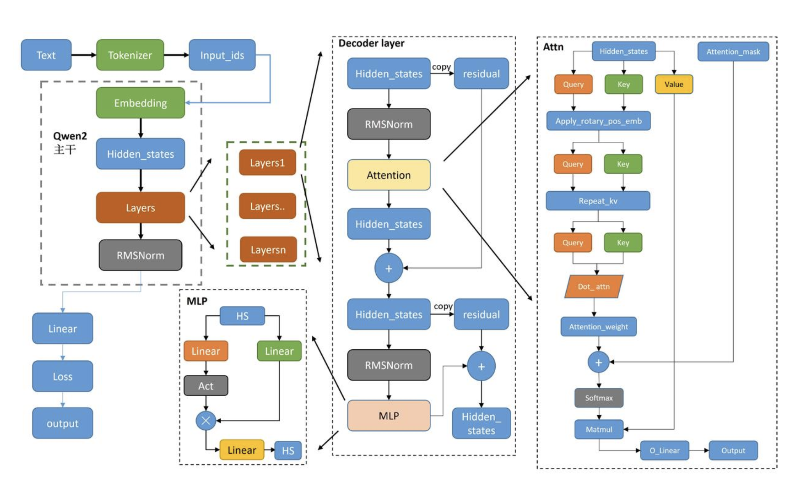
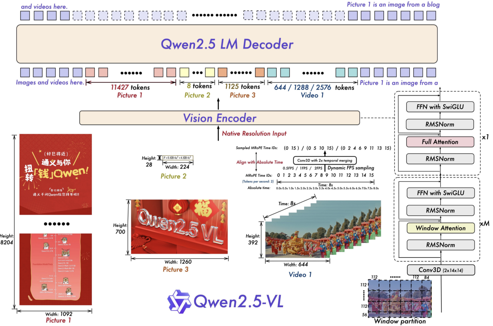

# Qwen2
模型结构示意图

```python
class Qwen2(nn.Module):
    """简化的Qwen2模型"""
    def __init__(self, vocab_size: int, dim: int, n_layers: int, n_heads: int, 
                 n_kv_heads: int, head_dim: int, hidden_dim: int, max_seq_len: int = 2048):
        super().__init__()
        self.vocab_size = vocab_size
        self.dim = dim
        self.n_layers = n_layers
        
        # 词嵌入
        self.tok_embeddings = nn.Embedding(vocab_size, dim)
        
        # 预计算RoPE频率
        self.freqs_cis = precompute_freqs_cis(head_dim, max_seq_len * 2)
        
        # Transformer层
        self.layers = nn.ModuleList([
            TransformerBlock(dim, n_heads, n_kv_heads, head_dim, hidden_dim)
            for _ in range(n_layers)
        ])
        
        # 输出归一化和线性层
        self.norm = RMSNorm(dim)
        self.output = nn.Linear(dim, vocab_size, bias=False)
        
        # 掩码（用于防止看到未来的token）
        self.register_buffer("mask", torch.tril(torch.ones(max_seq_len, max_seq_len)))
        
    def forward(self, tokens: torch.Tensor, start_pos: int = 0):
        batch_size, seq_len = tokens.shape
        
        # 获取嵌入
        h = self.tok_embeddings(tokens)
        
        # 获取RoPE频率和掩码
        freqs_cis = self.freqs_cis[start_pos: start_pos + seq_len]
        mask = self.mask[:seq_len, :seq_len]
        
        # 通过所有Transformer层
        for layer in self.layers:
            h = layer(h, freqs_cis, mask, start_pos)
        
        # 最终输出
        h = self.norm(h)
        output = self.output(h)
        return output
```

# Qwen2 VL


## tech detials
* 优化视觉编码器：引入窗口注意力机制，提高推理效率。
* 动态 FPS 采样：扩展动态分辨率到时间维度，实现对不同采样率视频的全面理解。
* 绝对时间对齐的 MRoPE：在时间域升级 MRoPE，通过与绝对时间对齐，促进更复杂的时间序列学习。
* 高质量数据：投入大量精力整理高质量的预训练和监督微调数据，并将预训练语料库从 1.2 万亿 tokens 扩展到 4.1 万亿 tokens。
* 原生动态分辨率：模型可以直接处理不同分辨率的图片，无需 resize。通过原生动态分辨率和绝对时间编码，Qwen2.5-VL 能够处理不同大小的图像和长时间视频，并能精确定位到秒级的事件。
* 增强 Agent 能力：通过高级的定位、推理和决策能力，Qwen2.5-VL 提升了在智能手机和电脑等真实场景中的 Agent 功能。
