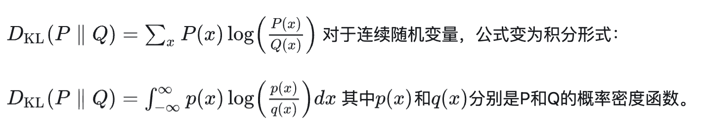
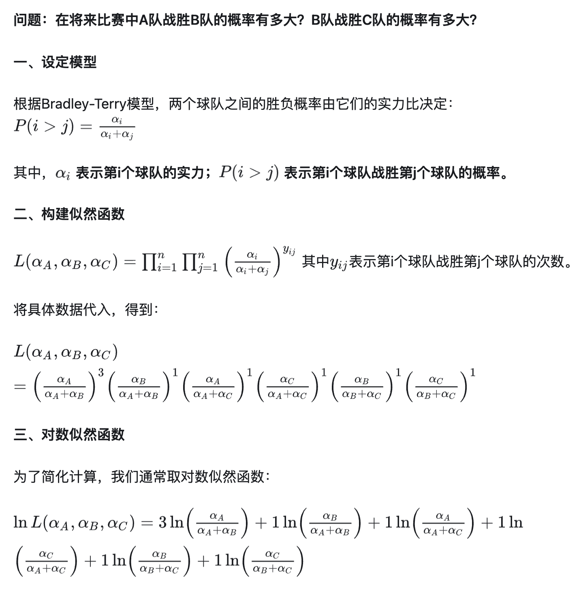
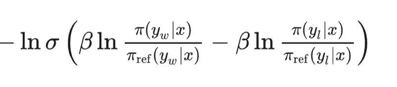

# DPO

# 代码运行：
```bash
python DPO.py
```

## 预备知识：
### KL 散度 
实际上就是信息熵,其定义为：

KL散度后续用于约束强化模型和参考模型之间预测的相似度，要求不能相差太远
### Bradley Terry 模型
用途是对比较关系进行建模

假设我们有一系列篮球比赛，并有以下历史比赛结果：
A 对 B：A 胜 3 次，B 胜 1 次
A 对 C：A 胜 1 次，C 胜 1 次
B 对 C：B 胜 1 次，C 胜 1 次


只要求解这个对数似然估计，我们就能得到队伍实力的预测值，在DPO中，主要用于对样本好坏关系的建模

## DPO公式推导
参考 [知乎link](https://zhuanlan.zhihu.com/p/15578845927)
最终的核心公式为：



## 代码的这一部分比较难理解

```python
def get_batch_logprobs(model, prompts, responses, device="cuda"):
    # 计算 response 的对数概率
    logprobs = F.log_softmax(logits, dim=-1)
    token_logprobs = torch.gather(logprobs[:, :-1], -1, inputs["input_ids"][:, 1:].unsqueeze(-1)).squeeze(-1)
    response_logprobs = (token_logprobs * response_mask[:, 1:]).sum(dim=-1)
    # 这里计算的是gather之后的结果，为什么呢？因为我们是对responses进行概率建模，而不关心词表中不相关的词的概率；
    # logprobs的形状是[bs, sqlenth, 词表长度] 我们只需要gather出词表长度中与response 对应的那个词的概率就好，而不在整个词表长度上进行计算
```