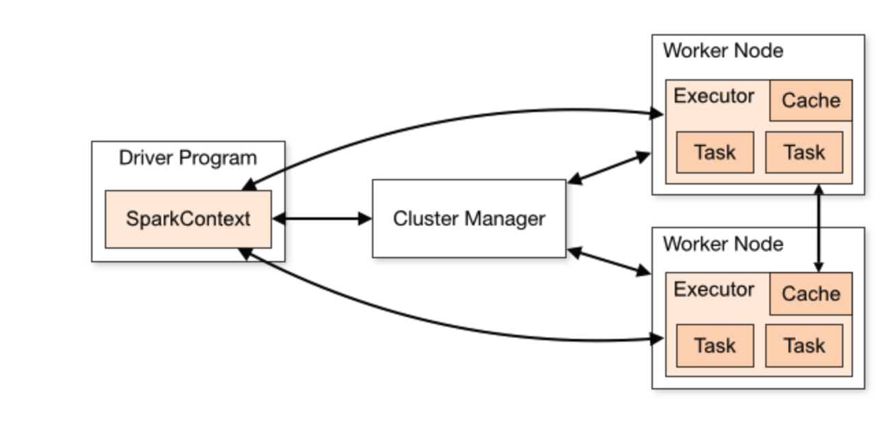

# PySpark 学习
本代码仅用于个人复习使用，代码中的敏感信息已经全部删除
spark有很多核心的功能，本文只对搜推场景下取数功能进行解析

## 基本工作逻辑
电商场景下数据量往往非常大，因此需要进行分布式存储和读取。现有的存储方案：
- [x] MapReduce
- [x] Hadoop
- [x] Spark

## 核心模块
* Spark Core:   提供 Spark 最核心的功能，是 Spark SQL、Spark Streaming 等其他模块实现的基础
* Spark SQL:	提供基于 SQL 或 HQL（Apache Hive 提供的 SQL 方言）进行数据查询的组件
* Spark Streaming:	Spark 平台上针对实时数据进行流式计算的组件
* MLlib	Spark: 平台的机器学习算法库
* GraphX:	Spark 面向图计算的组件与算法库

## Spark的运行架构


根据运行架构图，我们来简述一下 Spark 应用的运行过程：
* Driver 执行用户程序（Application）的 main() 方法并创建 SparkContext，与 Cluster Manager 建立通信
* Cluster Manager 为用户程序分配计算资源，返回可供使用的 Executor 列表
* 获取 Executor 资源后，Spark 会将用户程序代码及依赖包（Application jar）传递给 Executor（即移动计算）
* 最后，SparkContext 发送 tasks（经拆解后的任务序列）到 Executor，由其执行计算任务并输出结果

## Spark 常见术语
Application	基于 Spark 构建的用户程序
Application jar	包含用户 Spark 应用程序的 jar 包（不包含 Hadoop 和 Spark 依赖包，运行时由集群导入）
Driver Program	运行用户程序 main() 函数并创建 SparkContext 的进程
SparkContext	用户程序与 Spark 集群交互的主要入口，用于创建 RDD、累加器和广播变量等
Cluster Manager	集群资源管理器，其实现可以是 Standalone、Mesos、YARN 或 Kubernetes
Master Node	独立部署集群中的主节点，负责资源调度，类比 Yarn 中的 ResourceManager
Worker Node	独立部署集群中的从节点，负责执行计算任务，类比 Yarn 中的 NodeManager
Executor	Worker 节点上负责执行实际计算任务的组件
Task	分区级别的计算任务，是 Spark 中最基本的任务执行单元

## Spark 运行方式
搜广推场景下，Spark主要用于分布式数据的获取。公司会收集每天用户的多维度行为数据保存到一个很大的Hive表到分布式存储系统中，如果我们只用本地的小型服务器不可能在短时间内处理这么多的数据，因此需要使用Spark分布式框架来进行多进程的数据处理，从海量的数据维度中提取出我们想要的数据。简单类比，可以把spark堪称一个多线程表格数据读取器，用于对一个非常非常大的Excel表格进行数据抓取。

主要通过Spark的RDD分区以及相关RDD算子进行取数（数据读取）操作

### RDD算子逻辑
| 转换操作 | 说明 | 适用RDD类型 |
|----------|------|------------|
| **基本转换操作** | | |
| `filter(func)` | 筛选出满足条件(func返回true)的元素，返回新数据集 | 所有RDD |
| `map(func)` | 对每个元素应用func函数，一对一转换 | 所有RDD |
| `flatMap(func)` | 每个元素可映射到0或多个输出结果(func返回Seq) | 所有RDD |
| `mapPartitions(func)` | 以分区为单位应用func(接收迭代器，返回迭代器) | 所有RDD |
| `distinct([numPartitions])` | 对元素去重，返回新数据集 | 所有RDD |
| **键值对操作** | | PairRDD |
| `groupByKey([numPartitions])` | 将(K,V)转换为(K, Iterable<V>) | PairRDD |
| `reduceByKey(func, [numPartitions])` | 对相同Key的Value用func聚合(如加法) | PairRDD |
| `aggregateByKey(zeroValue)(seqOp, combOp, [numPartitions])` | 更灵活的聚合操作，可定义初始值和分区/合并逻辑 | PairRDD |
| `sortByKey([ascending], [numPartitions])` | 按照Key排序(默认升序) | PairRDD |
| **集合操作** | | |
| `union(otherDataset)` | 合并两个RDD，返回新数据集(不去重) | 所有RDD |
| `join(otherDataset)` | 内连接(K,V)和(K,W)→(K,(V,W)) | PairRDD |
| **分区操作** | | |
| `repartition(numPartitions)` | 重新分区(会产生shuffle) | 所有RDD |
| `coalesce(numPartitions)` | 减少分区数(避免shuffle) | 所有RDD |

### 关键特性说明：
1. **惰性执行**：所有转换操作都是延迟计算的，只有遇到Action才会触发执行
2. **窄依赖**：`map`/`filter`等操作保持分区关系(窄依赖)
3. **宽依赖**：`groupByKey`/`reduceByKey`等操作会导致shuffle(宽依赖)
4. **性能提示**：
   - 优先用`reduceByKey`而非`groupByKey`(减少shuffle数据量)
   - `repartition`会产生shuffle，而`coalesce`不会

### 实际代码逻辑讲解
由于需要公司内部环境才能运行，并且涉及很多公司内容，已做强马赛克处理
使用start.sh中的代码运行，主要通过spark-submit函数进行任务递交，递交到集群之后会根据sh中的配置安排driver（领导）和executor（工作者）进行数据读取
sh最后一行要给上pyspark代码的入口文件
pyspark文件主要通过以下的代码声明上下文，
```python
spk = SparkSession
```
通过以下的代码获得一个巨大的HIVE表
```python
sc.table("ad_search.retr_relevance_predictor_log")
```
然后再使用前面提到的RDD算子对这个表格进行进一步的处理，然后运行下面的代码将处理好的数据保存为csv到指定路径

```python 
sku_info_add_col_name0.repartition(200).write.option("sep", "\t").csv(
    "save_path", 
    mode='overwrite'
)
```

### cite
https://magicpenta.github.io/docs/spark/Spark%20RDD