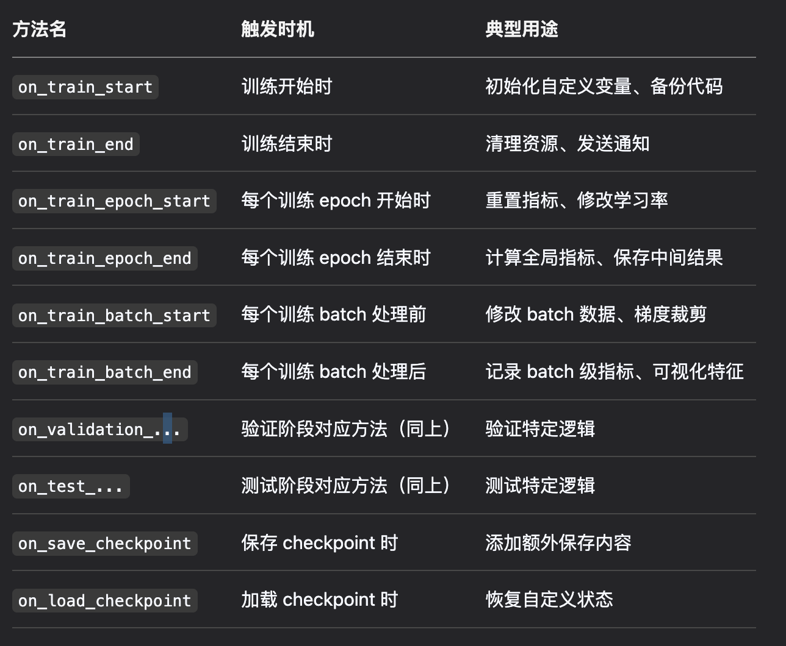

# 工作流程


# todolist
- [ ] LightningModule
- [ ] Trainer
- [ ] LightningDataModule
- [x] Callbacks
- [ ] Loggers
- [ ] Transforms & Data Augmentation
- [ ] Advanced Features

# callbacks函数
## 几种常用的内置call backs函数

1. ModelCheckpoint 自动保存模型
```python
# 保存验证集准确率最高的前3个模型
from pytorch_lightning.callbacks import ModelCheckpoint
checkpoint_callback = ModelCheckpoint(
    monitor="val_acc",
    dirpath="checkpoints/",
    filename="model-{epoch:02d}-{val_acc:.2f}",
    save_top_k=3,
    mode="max"
)
```
2. EarlyStopping 早停
```python
from pytorch_lightning.callbacks import EarlyStopping

early_stop_callback = EarlyStopping(
    monitor="val_loss",
    patience=5,    # 容忍轮次
    mode="min"     # 监控指标需最小化
)
```
3. LearningRateMonitor 实时记录学习率：

```python
from pytorch_lightning.callbacks import LearningRateMonitor
lr_monitor = LearningRateMonitor(logging_interval="epoch")
```

## 自定义 call backs 函数


举例，在搜索推荐场景中，我们在训练完模型进行测试时，往往需要保存每个batch输出的embedding，我们可以定义如下callback函数完成embedding的收集，这样我们就不用在predict_step()后面单独增加保存的逻辑了！只需要修改这个callbacks函数就能完成embedding的收集
用法还有很多，后续遇到实用的继续整理。
```python

from pytorch_lightning.callbacks import BasePredictionWriter
class UserSidePredictWriter( BasePredictionWriter ):
    """
    将模型产出的query与doc embedding写入文件
    """
    def __init__( self,
        # output_dir,
        writing_file,
        write_interval
    ):
        super().__init__( write_interval )
        self.fw = writing_file
        
    def write_on_batch_end( self, 
        trainer, pl_module,
        prediction,
        batch_indices, batch, batch_idx, dataloader_idx
    ):
        prediction = prediction.detach().cpu().numpy().astype( np.float32 )


        sku_id = batch['query_pos_skuid']

        if prediction.shape[0] != len(sku_id):
            raise ValueError("sku_id数量和inference结果数量不一致")
        
        for i in range(prediction.shape[0]):
            self.fw.write( '\t'.join([str(num) for num in sku_id[i]]+ [str(prediction[i].tolist())]) )
            self.fw.write( '\n' )

        self.fw.flush()
```
## call backs函数具体怎么用？

非常简单，只需要定义好你想要的callbacks功能，然后传入到trainer中，trainer在到达触发条件时就会自动完成callbacks指令达成收集的效果
```python 
from pytorch_lightning import Trainer

callbacks = [
    ModelCheckpoint(...),
    EarlyStopping(...),
    GradientWarningCallback(threshold=0.5),
    ProgressNotificationCallback(total_epochs=100)
]

trainer = Trainer(
    callbacks=callbacks,
    max_epochs=100
)
trainer.fit(model, datamodule) # fit指的是训练
```

